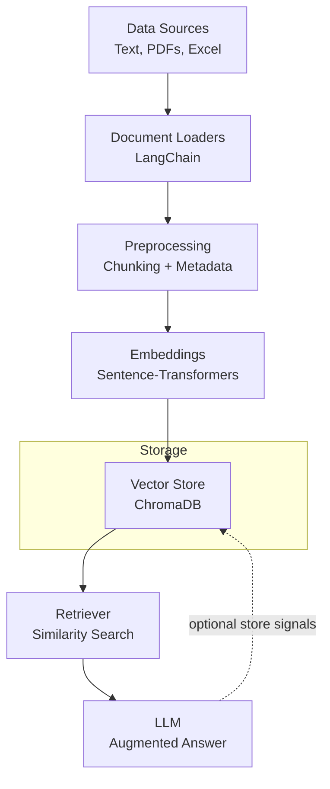

# RAG Pipeline - Data Ingestion

A comprehensive RAG (Retrieval-Augmented Generation) pipeline project focused on data ingestion using LangChain. This project demonstrates how to load and process various document types for building knowledge bases.

## 🧭 Overview

This project implements the data ingestion and retrieval backbone of a Retrieval-Augmented Generation pipeline. It loads heterogeneous documents (text, PDF, Excel), enriches them with metadata, chunks content, generates embeddings using sentence-transformers, and persists them into a vector store (Chroma). At query time, it retrieves the most relevant chunks to ground LLM responses with factual context.

## 🗺️ Architecture



## 🚀 Features

- **Document Loading**: Support for text files, Excel files, and directory-based loading
- **Metadata Management**: Rich metadata tracking for document sources
- **LangChain Integration**: Built on LangChain for robust document processing
- **Embedding Generation**: Sentence transformers for document embeddings
- **Vector Database**: ChromaDB integration for similarity search
- **Progress Tracking**: Visual progress indicators for bulk operations
- **Jupyter Notebooks**: Interactive examples and tutorials

## 📁 Project Structure

```
├── data/                    # Sample documents and text files
│   ├── excel/              # Excel files
│   │   └── top_10_countries_population.xlsx
│   ├── koh_samet.txt       # Travel guide content
│   ├── machine_learning.txt # ML concepts content
│   └── text_files/         # Additional text documents
├── notebook/               # Jupyter notebooks with examples
│   └── document.ipynb     # Data ingestion tutorials
├── main.py                # Main application entry point
├── requirements.txt        # Python dependencies
├── pyproject.toml         # Project configuration
├── uv.lock               # UV lock file for dependency management
└── README.md              # This file
```

## 🛠️ Installation

### Prerequisites
- Python 3.11 or higher
- uv package manager (recommended) or pip

### Setup

1. **Clone the repository**
   ```bash
   git clone <repository-url>
   cd 02-build-rag-pipeline
   ```

2. **Install dependencies**
   
   Using uv (recommended):
   ```bash
   uv sync
   ```
   
   Alternative with pip:
   ```bash
   pip install -r requirements.txt
   ```

3. **Verify installation**
   ```bash
   python main.py
   ```

## 📚 Usage

### Basic Document Loading

```python
from langchain.document_loaders import TextLoader

# Load a single text file
loader = TextLoader("data/koh_samet.txt", encoding="utf-8")
documents = loader.load()
```

### Directory-based Loading

```python
from langchain_community.document_loaders import DirectoryLoader

# Load all text files from a directory
loader = DirectoryLoader(
    "data",
    glob="*.txt",
    loader_cls=TextLoader,
    show_progress=True,
)
documents = loader.load()
```

### Excel File Loading

```python
from langchain_community.document_loaders import UnstructuredExcelLoader

# Load Excel files
loader = UnstructuredExcelLoader("data/excel/top_10_countries_population.xlsx")
documents = loader.load()
```

### Document with Metadata

```python
from langchain_core.documents import Document

document = Document(
    page_content="Your content here",
    metadata={
        "source": "example.pdf",
        "pages": 1,
        "author": "Author Name",
        "date": "2024-01-01"
    }
)
```

### Embedding Generation

```python
from sentence_transformers import SentenceTransformer
import numpy as np

class EmbeddingManager:
    def __init__(self, model_name: str = "all-MiniLM-L6-v2"):
        self.model_name = model_name
        self.model = SentenceTransformer(self.model_name)
    
    def generate_embeddings(self, documents: list[str]) -> np.ndarray:
        return self.model.encode(documents, show_progress_bar=True)

# Initialize and use
embeddings_manager = EmbeddingManager()
embeddings = embeddings_manager.generate_embeddings(["Document 1", "Document 2"])
```

## 🧪 Interactive Examples

Open the Jupyter notebook for hands-on examples:

```bash
jupyter notebook notebook/document.ipynb
```

The notebook includes:
- Document creation with metadata
- Text file loading
- Directory-based bulk loading
- Progress tracking examples

## 📦 Dependencies

- **langchain**: Core LangChain framework
- **langchain-core**: Core LangChain components
- **langchain-community**: Community-contributed loaders
- **sentence-transformers**: Text embedding generation
- **torch**: PyTorch for deep learning models
- **chromadb**: Vector database for similarity search
- **faiss-cpu**: Fast similarity search library
- **pypdf**: PDF processing capabilities
- **pymupdf**: Advanced PDF handling
- **unstructured[xlsx]**: Excel file processing
- **openpyxl**: Excel file reading/writing
- **tqdm**: Progress bars for long operations

### Version Compatibility

This project uses specific version constraints to ensure compatibility:
- `sentence-transformers==2.2.2`
- `huggingface_hub>=0.16.0,<0.26.0` (compatible with sentence-transformers)
- `torch>=2.1.0,<2.2.0`

## 🔧 Troubleshooting

### Common Issues

#### `cached_download` Import Error
If you encounter the error:
```
ImportError: cannot import name 'cached_download' from 'huggingface_hub'
```

**Solution**: This is fixed by using compatible versions. Ensure you're using:
- `huggingface_hub>=0.16.0,<0.26.0`
- `sentence-transformers==2.2.2`

Run `uv sync` to install the correct versions.

#### Jupyter Kernel Issues
If imports work in terminal but not in Jupyter:

1. **Restart the Jupyter kernel**: `Kernel` → `Restart Kernel`
2. **Clear output**: `Kernel` → `Restart & Clear Output`
3. **Re-run the import cells**

#### PyTorch Installation Issues
If you get PyTorch-related errors:

```bash
# Reinstall PyTorch
uv sync --reinstall
```

### Getting Help

- Check the [Issues](https://github.com/your-repo/issues) page
- Review the Jupyter notebook examples
- Ensure all dependencies are correctly installed with `uv sync`

## 🤝 Contributing

1. Fork the repository
2. Create a feature branch (`git checkout -b feature/amazing-feature`)
3. Commit your changes (`git commit -m 'Add some amazing feature'`)
4. Push to the branch (`git push origin feature/amazing-feature`)
5. Open a Pull Request

## 📄 License

This project is licensed under the MIT License - see the LICENSE file for details.

## 🔗 Related Projects

- [LangChain Documentation](https://python.langchain.com/)
- [RAG Pipeline Examples](https://github.com/langchain-ai/langchain)

---

**Note**: This project is part of a larger RAG pipeline tutorial series. Check out the other modules for complete RAG implementation.
